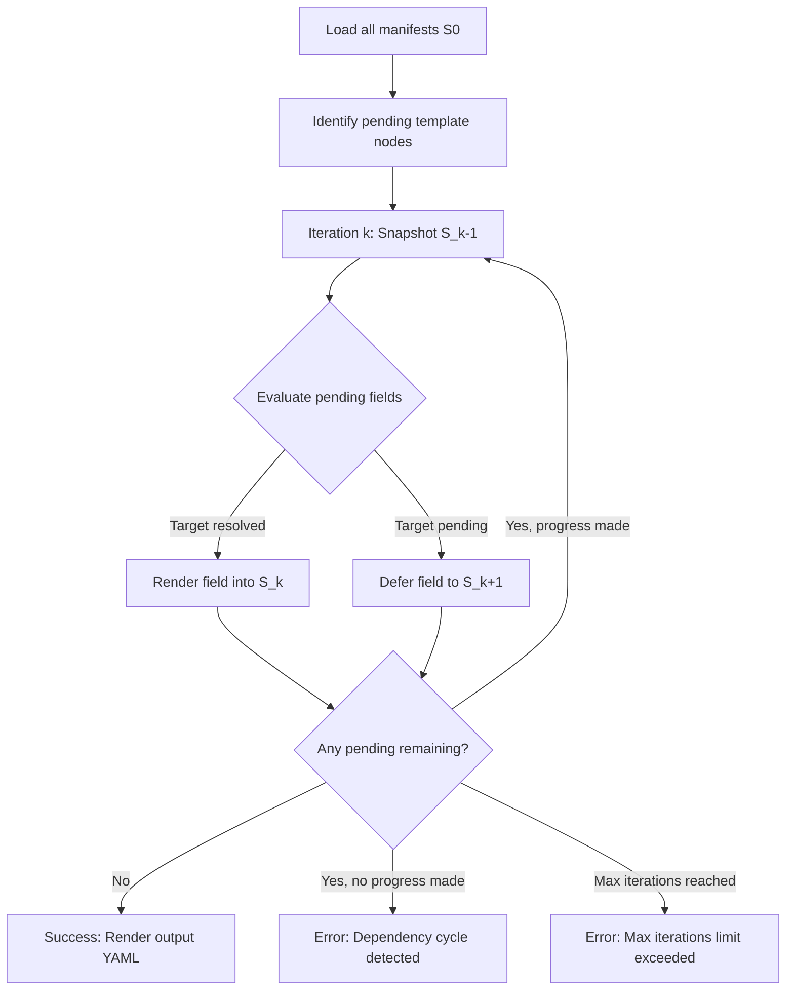

# Platform Architecture & Core Invariants

This guide describes the architectural model of `ktpl`, its execution semantics, and how it compares to existing configuration tools in the Kubernetes ecosystem.

---

## 1. The Kubernetes Configuration Problem Space

Platform and SRE teams have long faced compromises when managing configuration at scale:

```
                  +----------------------------------------------------+
                  |               The Configuration Dilemma            |
                  +----------------------------------------------------+
                                      /              \
                                     /                \
        [Text-Based Templating]                       [Structured / Patch-Based]
               (Helm)                                         (Kustomize)
        - Invalid YAML sources                        - Valid YAML sources
        - Brittle indentation                         - No cross-resource references without
        - "Values.yaml" indirection tax                 clunky, verbose `replacements`
        - Loss of native types                        - Inflexible JSON 6902 patches
```

Alternative programmable approaches (CUE, Jsonnet, Dhall, Timoni) introduce external domain-specific languages (DSLs) that impose steep learning curves on product developers and lack native ecosystem adoption.

### How ktpl Solves This

`ktpl` establishes three core architectural pillars:
1. **The Object IS the Value**: Manifests reference each other directly using the `ref` template function (`ref "ns/kind/name" "field.path"`). There is no intermediary `values.yaml` unless explicitly defined as a local ConfigMap.
2. **Sources Remain Valid YAML**: Every template expression is contained within a quoted scalar string. The entire manifest tree can be parsed by YAML linters, IDE schema validators, and static security analyzers before any rendering occurs.
3. **Iterative Fixed-Point Engine**: Complex, multi-hop dependency graphs are resolved through sequential Jacobi iterations without requiring the user to construct an imperative dependency DAG.

---

## 2. Comparative Matrix

| Capability / Attribute | Helm v3 | Kustomize | CUE / Jsonnet | **ktpl** |
|---|---|---|---|---|
| **Source format** | Go text templates + `values.yaml` | Plain Kubernetes YAML | Custom DSL (`.cue`, `.jsonnet`) | **Native Kubernetes YAML** |
| **Cross-resource references** | ❌ (Indirect through `values.yaml`) | ⚠️ Limited (`replacements`) | ✅ Full | **✅ Full (`ref "id" "path"`)** |
| **Sources valid YAML** | ❌ No (broken by template blocks) | ✅ Yes | ❌ No | **✅ Yes** |
| **Type preservation** | ⚠️ Strings by default (prone to schema bugs) | ✅ Yes | ✅ Yes (strict typing) | **✅ Single actions preserve native type** |
| **OCI Distribution** | ✅ Charts via OCI | ❌ (Git / HTTP / OCI plugins) | ⚠️ OCI modules (OCI/Oras) | **✅ Standard OCI artifacts** |
| **Multi-layer overlays** | ⚠️ Values files only | ✅ Folder overlays | ✅ Overlay imports | **✅ Multi-folder JSON Merge Patch** |
| **Cluster / Network access** | ⚠️ Reads cluster (lookup) or pure local | ✅ Pure local | ✅ Pure local | **✅ 100% Hermetic / Zero network required** |
| **Traceability of changes** | ❌ In manifest diffs only | ❌ None | ❌ None | **✅ `ktpl.io/rendered` and `sources`** |

---

## 3. The Iteration Engine (Jacobi Fixed-Point Model)

### Snapshot Semantics

Rather than building an explicit directed acyclic graph (DAG) or mutating objects in an unpredictable order, `ktpl` applies **Jacobi iteration semantics**:

1. **State $S_0$ (Load & Register)**:
   - All input manifests (from local folders, archives, and OCI layers) are loaded and merged into an initial state $S_0$.
   - A **pending registry** tracks every YAML scalar node that contains template delimiters (`{{ ... }}`).
2. **Iteration $k$ ($S_k$ Evaluation)**:
   - For every pending field, `ktpl` evaluates its template against a read-only snapshot of state $S_{k-1}$.
   - If a `ref` points to a node that is still marked as pending in $S_{k-1}$ (or to a map/list with pending children), the function returns the `errDeferred` sentinel.
   - The field remains pending and will be retried in iteration $k+1$.
   - If all references are resolved, the field renders and updates the state for $S_k$.
3. **Termination Conditions**:
   - **Success**: Zero pending fields remain.
   - **Dependency Cycle**: Iteration $k$ completes with pending fields, but zero fields were resolved in iteration $k$ (deadlock).
   - **Max Iterations Exceeded**: The loop reaches `--max-iterations` (default: 5) with pending fields remaining.



### Why Snapshot Semantics Matter to SREs

- **Determinism**: Processing order within an iteration does not affect the output. Regardless of whether Object A or Object B is evaluated first in Go memory, they both read from $S_{k-1}$.
- **Never Re-parsing Rendered Output**: A rendered string containing `{{` is never re-evaluated. This prevents recursive template injection vulnerabilities and unintended side effects.
- **Dependency Depth as Iteration Count**: The iteration number where a field resolves is exactly equal to its dependency depth. This is recorded in the `ktpl.io/rendered` annotation.

---

## 4. Strict Typing Mechanics

One of the most persistent operational bugs in Kubernetes templating is string-typed numbers and booleans (e.g. `replicas: "3"` or `port: "80"`), which fail Kubernetes schema validation.

`ktpl` enforces a strict typing invariant:
* **Single Action**: If a string contains **exactly one template action** with no leading or trailing characters, `ktpl` preserves the **native Go pipeline type**:
  ```yaml
  replicas: '{{ ref "shop/configmap/app" "data.replicas" | int }}'     # Emitted as int: 3
  enabled: '{{ ref "shop/configmap/app" "data.enabled" | eq "true" }}' # Emitted as bool: true
  ports: '{{ ref "shop/service/api" "spec.ports" }}'                   # Emitted as list of maps
  ```
* **Composite Expressions**: If an action is accompanied by surrounding text or multiple actions, it is emitted as a string:
  ```yaml
  databaseUrl: 'postgres://{{ ref "shop/cm/db" "data.host" }}:5432/app' # Emitted as string
  ```

---

## 5. Architectural Invariants

To guarantee production safety, `ktpl` enforces non-negotiable invariants:

1. **Zero Infrastructure**: Single static Go binary (`CGO_ENABLED=0`). Flat files in, flat files out. No cluster API calls, no daemon, no database.
2. **Identity Rules**:
   - `apiVersion` and `kind` cannot be templated.
   - Objects with templated `metadata.name` or `metadata.namespace` are classified as **floating objects**: they render normally, but **can never be referenced by any other object**.
3. **Explicit Namespaces**: Identifiers are either 3 segments (`<namespace>/<kind>/<name>`) or 2 segments (`<kind>/<name>`). `ktpl` never guesses the namespace or assumes a default.
4. **Structured YAML Manipulation**: Operates exclusively on `yaml.Node` AST trees (`go.yaml.in/yaml/v3`). Comments, key order, and multi-line literal formatting (`|`) are strictly preserved.
5. **Per-Iteration Linting**: After every iteration step, all objects pass through structural validation (RFC 1123 naming, label and annotation constraints). Failures abort immediately with file, line, and path context.
